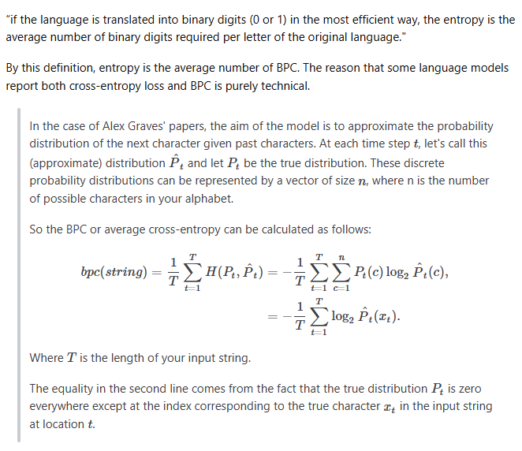

# Expose.AI

A browser extension that helps identify AI-generated accounts on social media platforms through community-driven engagement and analysis.

## Overview

Expose.AI is a browser extension designed to combat the proliferation of bot and AI-generated accounts on platforms like Reddit, X (Twitter), and others. When installed, the extension provides real-time indicators showing which users have been analyzed and flagged as potential bots, helping to "humanize" the internet again.

## How It Works

1. **Manual Analysis**: When you encounter a suspicious user, you can trigger an analysis directly from their comment/post.
2. **Deep Scan**: The extension retrieves the user's last 100 posts/comments from the reddit API and tokenizes each comment/post and related context to assist in detection. Context retreival and tokenization are by far the most intricate and impactful pieces of this project so how they are performed will be constantly evolving.
3. **AI Detection**: Each tokenized comment/post is evaluated for AI-generated text patterns, and an individual score is calculated for each and then aggregated across a user's entire history.
4. **Bot Flagging**: Users exceeding a certain threshold are flagged as likely bot/AI accounts
5. **Shared Database**: All calculated data points and results will be stored in a central database (most likely firebase), so every user who installs the extension will benefit from the entire community's findings and updates are pushed out in realtime.

## Key Features

- **Community-Powered**: Any user with the extension installed can analyze suspicious accounts, building a shared database of known bots
- **Real-Time Indicators**: Instantly see if a user has been analyzed and flagged as you browse
- **Advanced Detection**: Leverages perplexity-based transformers, BERT models, bits-per-character performance checks and "anti" cross entropy checks for (hopefully) accurate AI text detection. Contextual/behavorial checks (having more than 8 braincells on r/4chan or only posting on r/politics) are still up in the air as idk how to approach these with no bias.
- **Multi-Platform Support**: Initially rolling out on Reddit but if detection models actually work, this is fully scalable across any text based platform and possibly multi-modal platforms as well.

## Motivation

Over the past 3-5 years, the [Dead Internet Theory](https://en.wikipedia.org/wiki/Dead_Internet_theory) has felt less like a theory and more like reality. This extension is an attempt to shine a light on the automated accounts flooding social media and help users distinguish genuine human interaction from AI-generated content.

## Technology

- Perplexity Transformers: https://huggingface.co/docs/transformers/perplexity
- Browser Extension Framework
- Centralized Database for shared analysis results

## Firestore schema (initial)

- `analysisRequests/{requestId}`

  - `platform`: `"reddit" | "x" | "generic"`
  - `userId`: platform identifier (e.g., Reddit username)
  - `maxItems`: number (<=100)
  - `includeParent`: boolean
  - `status`: `"queued" | "fetching" | "scoring" | "done" | "error"`
  - `createdAt`: ms epoch
  - `updatedAt`: ms epoch
  - `requestHash`: optional dedup key
  - `errorMessage`: optional

- `analysisResults/{requestId}`
  - `requestRef`: path to the originating `analysisRequests` doc
  - `platform`, `userId`
  - `userScore`: 0..1
  - `analyzedCount`, `totalCount`
  - `perComment`: array of `{ commentId, score, numTokens, hasParent }`
  - `method`: scorer descriptor/version
  - `createdAt`: ms epoch

## References

https://datascience.stackexchange.com/questions/56145/what-is-bit-per-character

https://thegradient.pub/understanding-evaluation-metrics-for-language-models/

https://arxiv.org/pdf/1308.0850

#

In a sad twist of irony, I had gippity create most of this README for me because I hate documentation.. oh well.
